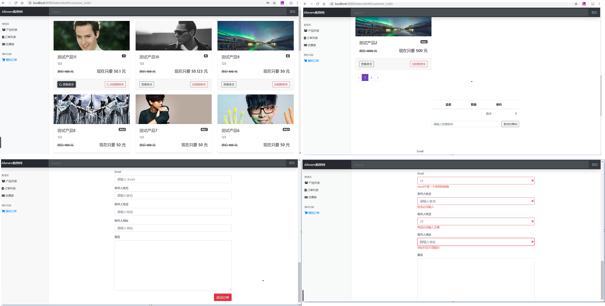

# vue-dashboard

> A Vue.js project: shoppingWeb   

<<<<<<< HEAD
## Demo Address
=======
## 演示地址：
>>>>>>> 751c97614720940af9b037dd6168bb655a4cf129

https://allenem.github.io/vue-dashboard/dist/index.html

### tips
<<<<<<< HEAD
* 1.模拟订单 **无需登录**

* 2.产品列表、订单列表、优惠券部分 **需要登录**   
  + 可以使用默认账号密码
  + 也可以clone项目到本地，自己注册添加修改商品信息，注意修改 config/dev.env.js 和 config/prod.env.js 中的 ```CUSTOMPATH``` 为自己的API。
  + 参考注册账号，申请API网址：https://vue-course-api.herokuapp.com/ (老师给的接口，非常感谢)   
=======
* 1.产品列表、订单列表、优惠券部分 <b>需要登录</b>   
    ①可以自己注册添加商品：参考注册申请API网址：https://vue-course-api.herokuapp.com/   
    ②也可以使用我这个（Email Address:1820988819@qq.com , Password:xys0806）
    
* 2.模拟订单 <b>无需登录</b>
>>>>>>> 751c97614720940af9b037dd6168bb655a4cf129

## Build Setup

``` bash
# install dependencies
npm install

# serve with hot reload at localhost:8080
npm run dev

# build for production with minification
npm run build

# build for production and view the bundle analyzer report
npm run build --report
```

For a detailed explanation on how things work, check out the [guide](http://vuejs-templates.github.io/webpack/) and [docs for vue-loader](http://vuejs.github.io/vue-loader).

## Used
* Vue-cli
<<<<<<< HEAD
* Vue-axios
* Bootstrap4
* 参考注册申请API网址：https://vue-course-api.herokuapp.com/ (老师给的接口，非常感谢)
=======
* vue-axios
* bootstrap4
* 参考注册申请API网址：https://vue-course-api.herokuapp.com/ （别人写的后台我只是拿来用，非常感谢）
>>>>>>> 751c97614720940af9b037dd6168bb655a4cf129
* filter
* vee-validate

## Data  
```json
[
  {
    "category": "測試分類",
    "id": "-LREz8_3Df7aMDcFI8mU",
    "image": "https://images.unsplash.com/photo-1516550135131-fe3dcb0bedc7?ixlib=rb-0.3.5&ixid=eyJhcHBfaWQiOjEyMDd9&s=621e8231a4e714c2e85f5acbbcc6a730&auto=format&fit=crop&w=1352&q=80",
    "origin_price": 1000,
    "price": 500,
    "title": "測試的產品",
    "unit": "單位",
    "num": 1
  },
  {
    "category": "測試分類",
    "id": "-LREyEWgcMSrCSQ-elg3",
    "image": "https://images.unsplash.com/photo-1516550135131-fe3dcb0bedc7?ixlib=rb-0.3.5&ixid=eyJhcHBfaWQiOjEyMDd9&s=621e8231a4e714c2e85f5acbbcc6a730&auto=format&fit=crop&w=1352&q=80",
    "origin_price": 1000,
    "price": 500,
    "title": "測試的產品",
    "unit": "單位",
    "num": 2
  }
]
```

## Thanks
[【前端教程】——Vue 出一個電商網站（下）](https://www.bilibili.com/video/av35541119)

## Done
- [x] :point_up_2: 登录页
- [x] :gift: 产品列表页布局
- [x] :pencil: 产品列表增、删、改
- [x] :card_index: 模拟订单页布局
- [x] :scroll: 模拟订单详情
- [x] :heavy_plus_sign: 模拟订单加入购物车
- [x] :pencil2: 模拟订单购物车显示和删除
- [x] :clipboard: 模拟订单用户信息填写及验证
- [x] :moneybag: 付款页布局
- [x] :money_with_wings: 付款页付款成功与否的验证显示
- [x] :white_circle: 页面和按钮懒加载效果
- [x] :iphone: 手机自适应

## Todo List
- [ ] :bookmark_tabs: 订单列表页
- [ ] :ticket: 优惠券页
- [ ] :credit_card: 使用优惠券
- [ ] :eyes: 搜索功能

## Effect Images :tada::confetti_ball::balloon:

* 1login2productspageone3productspageone4lazyloading
   

* costermer_order
   

* newOrEditOrDelProduct
   

* payPageAndOthers
   
<<<<<<< HEAD

## Others

本来想用router的mode为history，因为默认的hash模式有#太丑但是发现用history模式好像要有后端配置，放弃了。[官网](https://router.vuejs.org/zh/guide/essentials/history-mode.html)有如下说明：   

>``` vue-router ```默认``` hash ```模式 —— 使用 URL 的 hash 来模拟一个完整的 URL，于是当 URL 改变时，页面不会重新加载。
>
>如果不想要很丑的 hash，我们可以用路由的 history 模式，这种模式充分利用 history.pushState API 来完成 URL 跳转而无须重新加载页面。
>```js
>const router = new VueRouter({
>  mode: 'history',
>  routes: [...]
>})
>```
>当你使用 history 模式时，URL 就像正常的 url，例如 http://yoursite.com/user/id 也好看！
>不过这种模式要玩好，还需要后台配置支持。因为我们的应用是个单页客户端应用，如果后台没有正确的配置，当用户在浏览器直接访问 http://oursite.com/user/id 就会返回 404，这就不好看了。
>   
>所以呢，你要在服务端增加一个覆盖所有情况的候选资源：如果 URL 匹配不到任何静态资源，则应该返回同一个 index.html 页面，这个页面就是你 app 依赖的页面。
=======
>>>>>>> 751c97614720940af9b037dd6168bb655a4cf129
